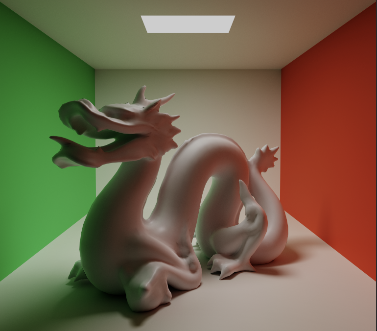
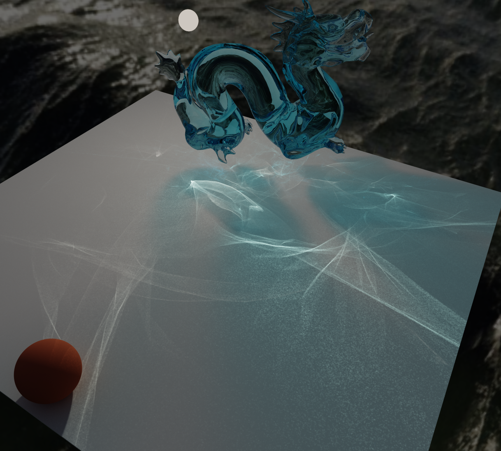
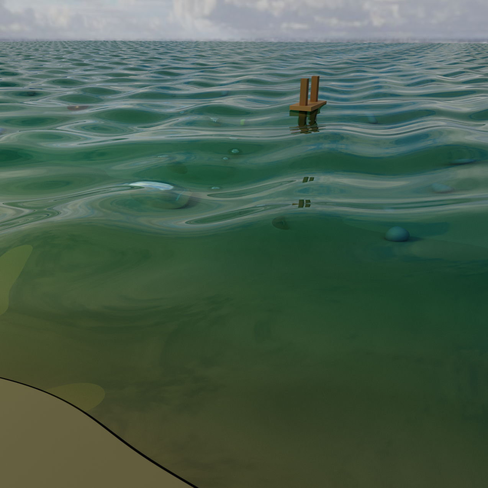
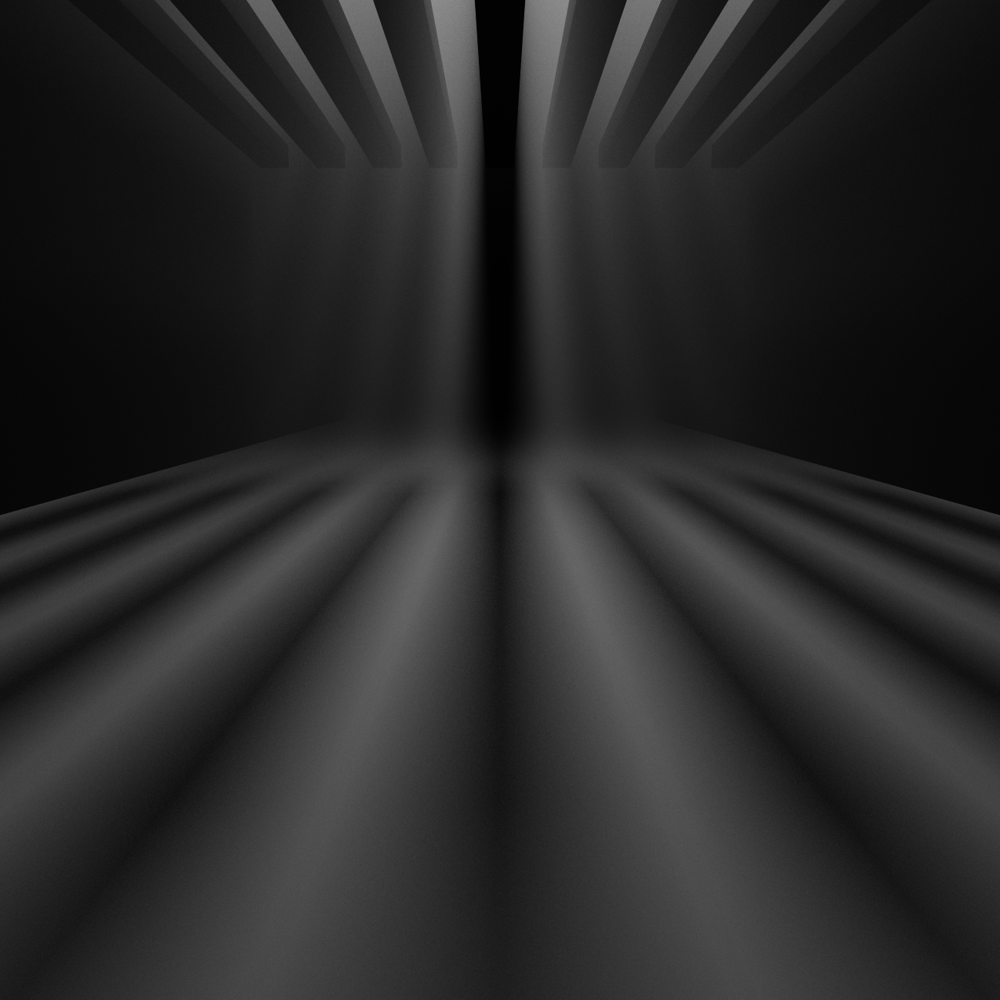
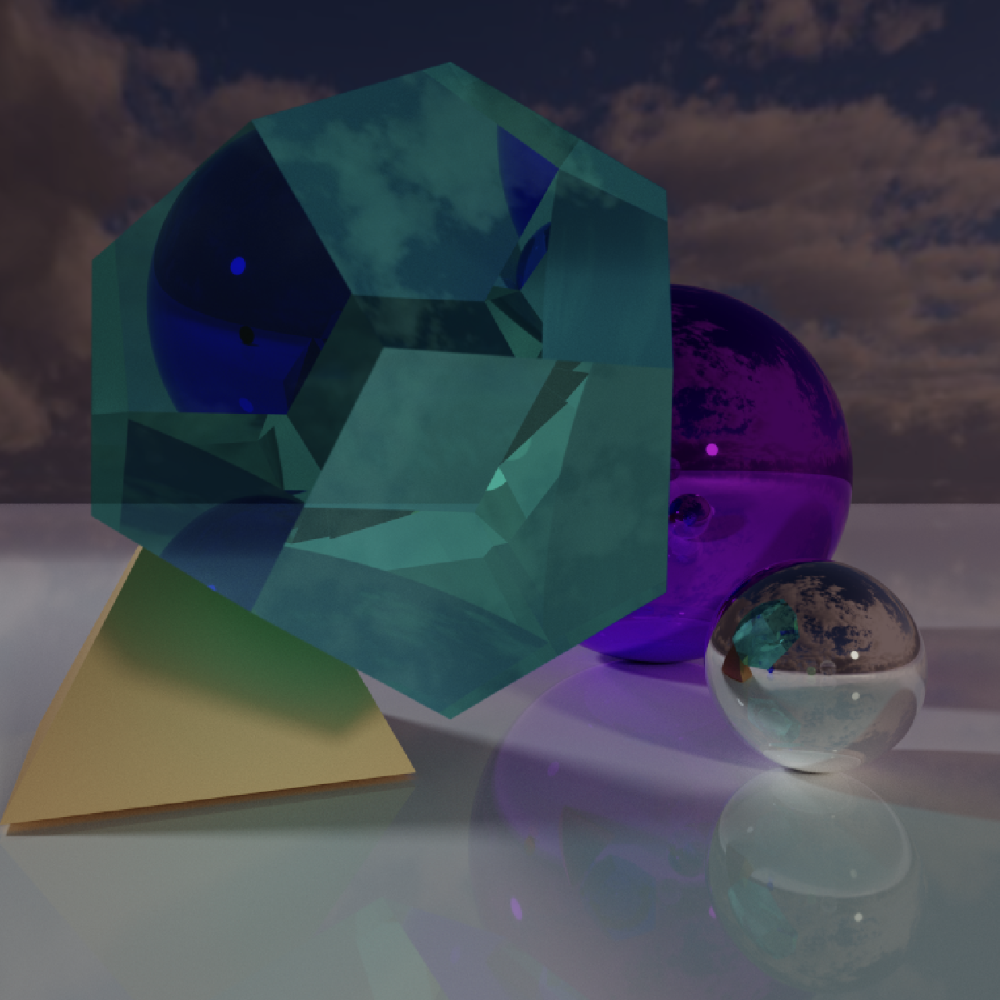

# Realtime Path Tracing
Realtime 3D raytracer running in a GPU compute shader in Unity.

Features:
* GPU compute-shader path tracing for spheres and registered triangle meshes
* Emissive sphere and mesh lights with direct-light sampling
* Surface reflections, diffuse indirect lighting, and multiple ray bounces
* Glass reflection/refraction, distance-based absorption, and colored transparent shadows
* Mesh UV/albedo textures
* Optional animated procedural water with reflection, refraction, and underwater absorption
* Hard and soft shadows
* Depth of field with auto-focusing
* Frame accumulation, dynamic quality, debug views, and benchmark scenes
* Volumetric fog

Features missing or approximate:
* Spectral refractions (different wavelengths of light refract differently)
* Material texture maps beyond mesh albedo

There are multiple quality settings on the GameManager object in the root scene. At normal settings you should be able to easily sustain 60+ frames per second. At the highest settings you'll end up with frames taking hundreds of milliseconds to render and you'll need image accumulation on to get good clarity.

