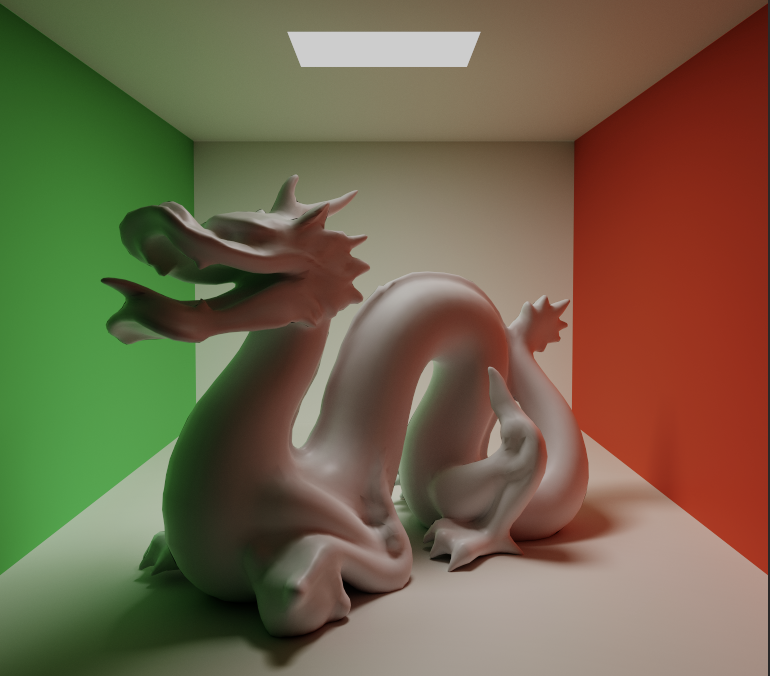
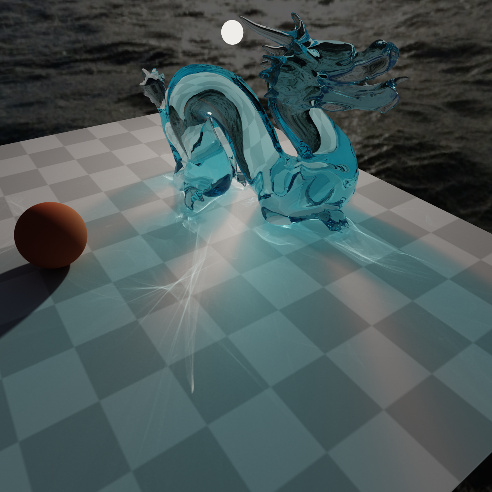
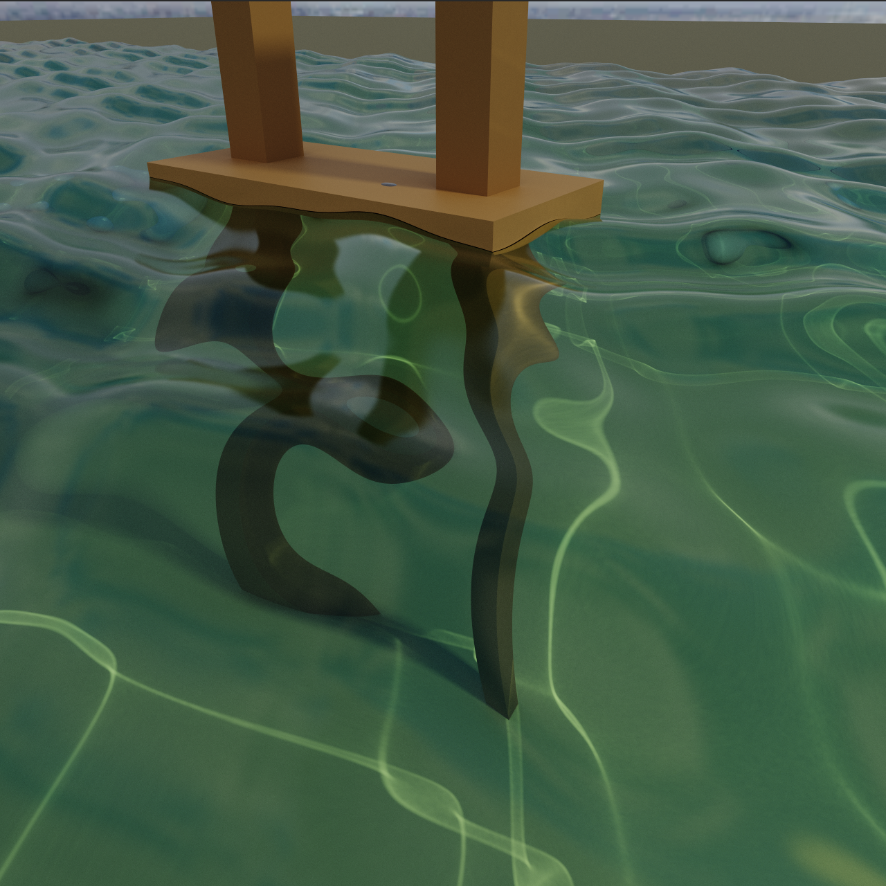
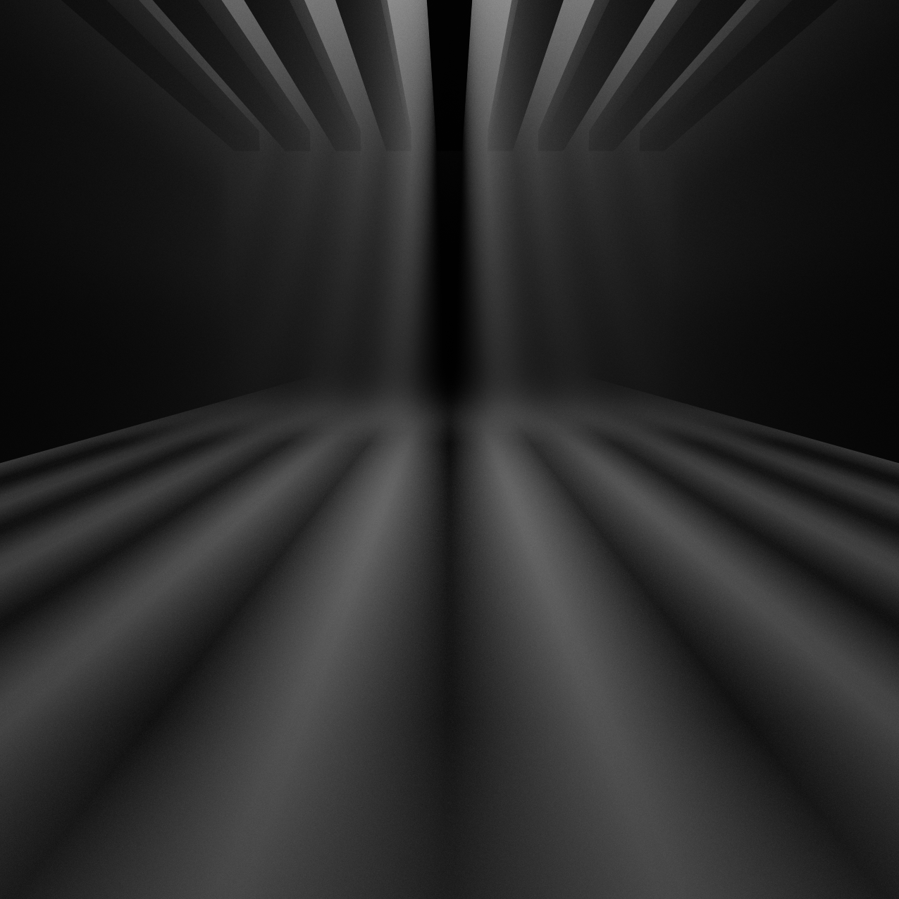

# Realtime Path Tracing
Realtime 3D path-tracer running in a GPU compute shader in Unity.

Features:
* GPU compute-shader path tracing for spheres and registered triangle meshes
* Emissive sphere and mesh lights with direct-light sampling -- (128 triangle limit for mesh lights currently)
* Surface reflections (configurable smoothness of surfaces), diffuse indirect lighting, and multiple ray bounces
* Glass reflection/refraction, distance-based absorption, and colored transparent shadows
* Mesh UV/albedo/metallic/normal texturing
* Optional animated procedural water with reflection, refraction, and underwater RGB absorption
* Hard and soft shadows
* Depth of field, variable camera aperture, different aperture types, ability to focus on a point in the scene even while camera is in motion
* Frame accumulation, dynamic quality, debug views, and benchmark scenes
* Volumetric fog (homogeneous fog)
* Spatial denoising (basic hand-rolled, not machine-learned denoising)

Features missing or approximate:
* Spectral refractions (different wavelengths of light refract differently)
* Temporal denoising is a work-in-progress
* Glass smoothness and opacity directly affect how reflective its surface is currently, I need to change this so there can be less reflective glass regardless of smoothness
* Considering adding the option for machine-learning-based upscaling and denoising, and when rendering in real time, possibly even frame insertion to improve frame rate
* Fog that isn't homogenous
* Subsurface scattering
* Ability to see the scene within Unity's scene view, most objects currently do not have meshes or textures that Unity can see
* Shader compilation can take quite a while, I'd like to optimize this

There are multiple quality settings on the GameManager object in the root scene. Depending on the scene and quality, and your hardware, your frame rate may vary by quite a bit. Realtime can look decent on the right hardware with the right scene and settings. Some features like water and caustics are too expensive to look good in realtime currently.

Project has only been tested for MacOS, but all code should be OS-agnostic, so if it works in Unity then you should be able to run it.

### Caustics

### Water with light absorption, reflection, refraction, and caustics

https://github.com/user-attachments/assets/c2fa9427-c246-47ff-9919-e17c34094d6f

### Volumetric Fog

### Special Thanks!
Thanks to these projects which have been great reference and learning material:

* https://github.com/knightcrawler25/GLSL-PathTracer/
* https://github.com/tylertms/vkrt
* https://github.com/gkjohnson/three-gpu-pathtracer
