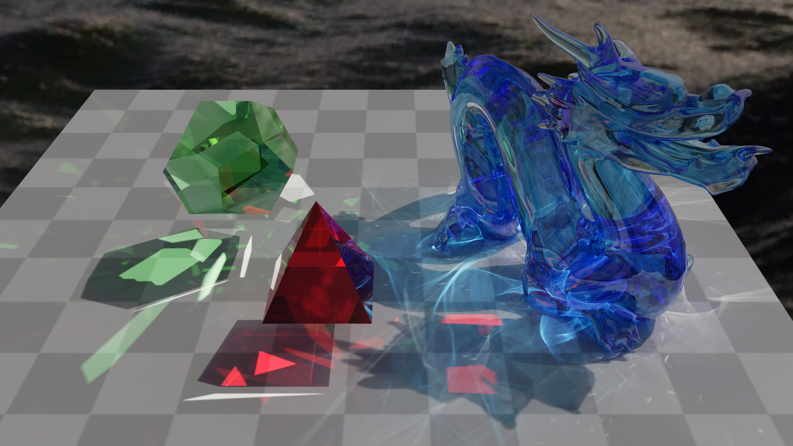
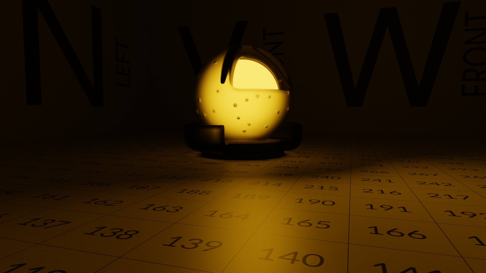
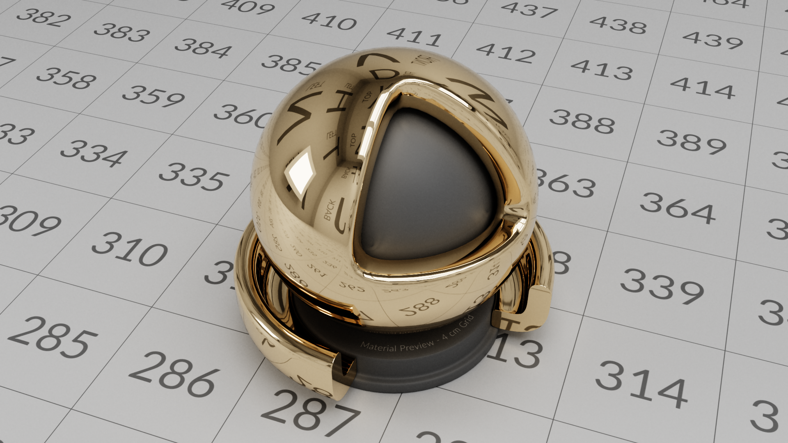
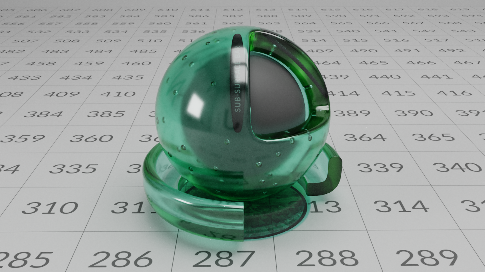
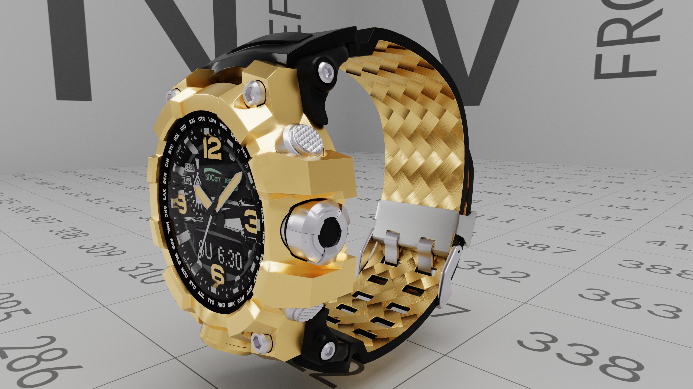
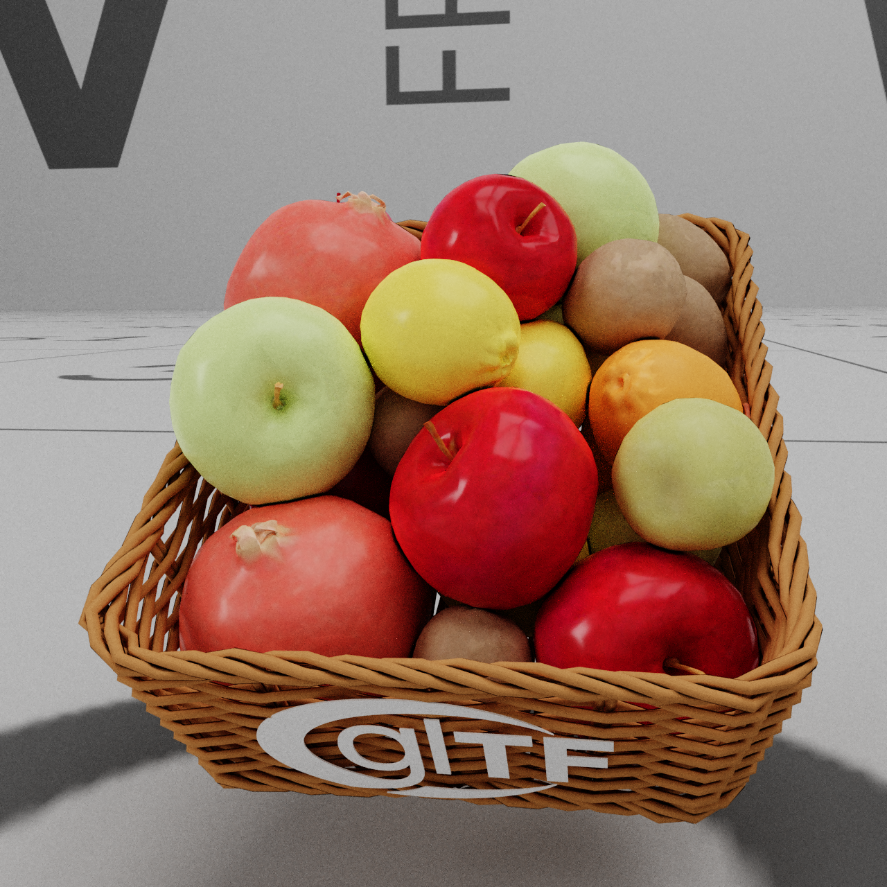
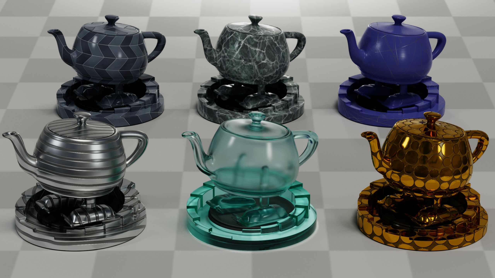
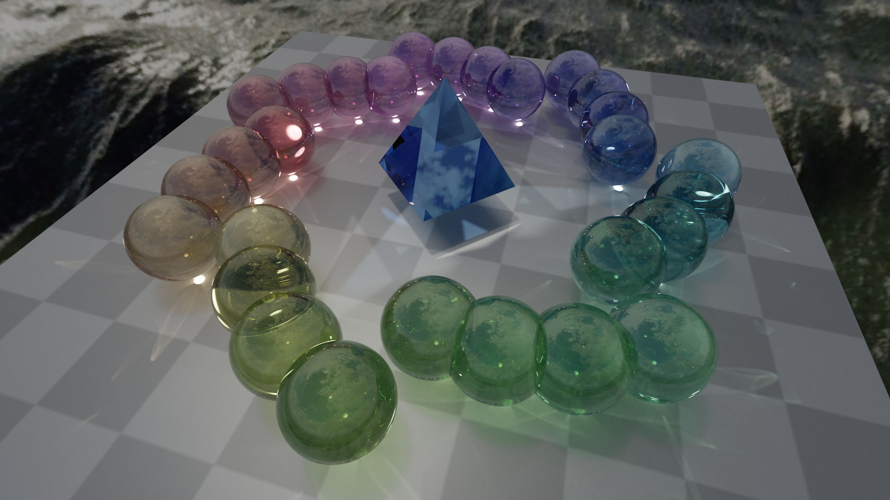

# Realtime Path Tracing
Realtime 3D path-tracer running in a GPU compute shader in Unity, it does **not** require RT hardware (DXR/RT cores) or CUDA.
Full disclosure that LLMs were used to assist during the later work on this project.

## Features:
* GPU compute-shader path tracing for spheres and registered triangle meshes
* Emissive sphere and mesh lights with direct-light and sampling
* Surface reflections (configurable smoothness of surfaces), diffuse indirect lighting, directional lighting, and multiple ray bounces
* Reflection/refraction, distance-based absorption, and colored transparent shadows
* Photon-mapped caustics
* Mesh UV/albedo/metallic/normal texturing
* Animated procedural water with reflection, refraction, caustics, and underwater RGB absorption
* Depth of field, variable camera aperture, different aperture types, ability to focus on a point in the scene even while camera is in motion
* Frame accumulation, debug views, and example scenes
* Volumetric fog (homogeneous fog)
* Spatial denoising (basic hand-rolled, not machine-learned denoising)
* ACES filmic tone mapping with configurable exposure and optional firefly luminance clamping
* Normal and parallax mapping
* glTF/GLB import support, including automatic conversion of base-color, metallic-roughness, normal, and transmission/IOR material data into ray-traced materials.
* Support for Unity terrains with multi-texture splatting

## Features missing or approximate:
* Spectral refractions (different wavelengths of light refract differently), current lighting system does not handle wavelengths
* Temporal denoising is a work-in-progress
* Considering adding the option for machine-learning-based upscaling and denoising, and when rendering in real time, possibly even frame insertion to improve frame rate
* Heterogeneous fog
* Subsurface scattering
* Shader compilation can take quite a while, I'd like to optimize this
* Environment mapped lighting instead of just direct sky reflections

Depending on the scene and quality, and your hardware, your frame rate may vary by quite a bit. Realtime can look decent on the right hardware with the right scene and settings. Some features like water and caustics are too expensive to look good in realtime currently.

Project has only been tested for MacOS, but all code should be OS-agnostic, so if it works in Unity then you should be able to run it.

### Caustics

### Water with light absorption, reflection, refraction, and caustics

https://github.com/user-attachments/assets/c2fa9427-c246-47ff-9919-e17c34094d6f

https://github.com/user-attachments/assets/4ff5669a-c7db-427c-8167-707b0ca8e22f

Note: These video were rendered offline, at around 45-75 seconds per frame.

### Overlapping materials, emissive materials

### Can load in models directly from Khronos

### Materials scene (reference materials/example from GLSL-PathTracer project)

### Volumetric Fog

### Misc

## Quick Start

1. Install Unity `6000.3.18f1` through Unity Hub.
2. Open this repository as a Unity project and wait for package import to complete.
3. Run `Tools > Ray Tracing > Generate Getting Started Scene`, then open `Assets/Scenes/Generated/GettingStarted.unity`.
4. Run `Tools > Ray Tracing > Precompile Compute Shader` before entering Play mode. See the first-run note below before continuing.
5. Enter Play mode and view the **Game** tab. The Getting Started scene opens the **Ray Tracing Controls** panel, which keeps renderer settings available while you inspect other objects.

> [!WARNING]
> **The first compute-shader compilation can take several minutes.** Unity may appear to be frozen or show a spinning cursor while it compiles synchronously. On an Apple M3 Max, a cold compile has taken 3-5 minutes. Leave Unity running until the precompile operation completes; subsequent runs are normally much faster unless the shader or its variants change.

The project has been tested on macOS. It requires a Unity editor session with compute-shader support; GPU rendering and GPU tests cannot run with a Null graphics device such as `-nographics`.

## Controls

| Control | Action |
| --- | --- |
| `W` / `A` / `S` / `D` | Move the free camera |
| Arrow keys | Look around |
| Left click | Focus at the cursor when click-to-focus is enabled |
| `Space` | Toggle paused refinement mode |
| `Z` | Toggle the live performance and renderer diagnostics overlay |
| `X` | Toggle benchmark controls |
| `B` | Run the benchmark while benchmark controls are visible |
| `H` | Hide or show the Getting Started help overlay |

Use `Window > Ray Tracing > Quick Controls` to reopen the persistent controls panel. It contains all `GameManager` renderer categories first, followed by scene-specific material and light controls when the active scene provides them. `Window > Ray Tracing > Scene Gallery` opens a dockable tab alongside those controls with curated showcase scenes, expected costs, and Open Scene / Open And Play actions.

## Scenes

`GettingStarted.unity` is the recommended first scene: it is a compact diffuse, metal, and glass showcase configured for a quick first render. Generate it once from `Tools > Ray Tracing > Generate Getting Started Scene`. The remaining checked-in scenes in `Assets/Scenes/Generated/` demonstrate individual features and performance workloads. They are already included in the repository; generating scenes is only necessary after changing the scene generator.

Useful next scenes include:

| Scene | Demonstrates |
| --- | --- |
| `Glass.unity` | Reflection, refraction, and absorption |
| `CornellBox.unity` | Enclosed indirect lighting and recursive reflections |
| `Water.unity` | Animated water reflection, refraction, and absorption |
| `VolumetricFog.unity` | Homogeneous volumetric fog |
| `Terrain.unity` | Ray-traced Unity terrain |
| `ManySpheres.unity`, `ManyMeshes.unity`, `ManyLights.unity` | Stress and benchmark workloads |

### Special Thanks
Thanks to these projects which have been great reference and learning material:

* https://github.com/gkjohnson/three-gpu-pathtracer
* https://github.com/knightcrawler25/GLSL-PathTracer/
* https://github.com/tylertms/vkrt
